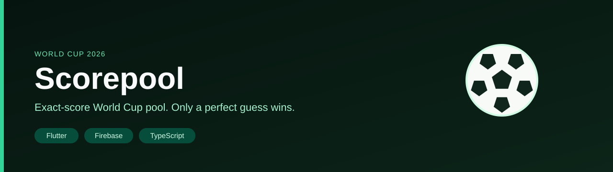
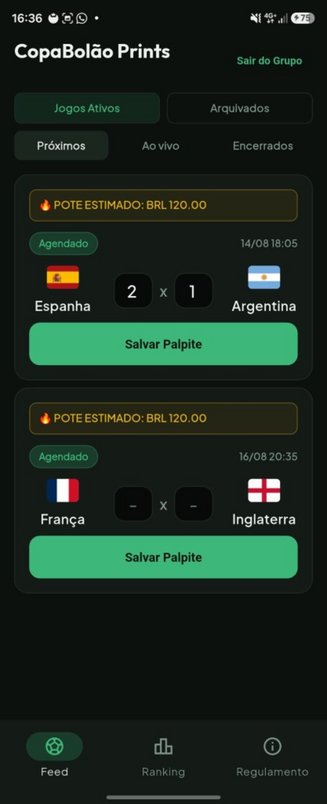
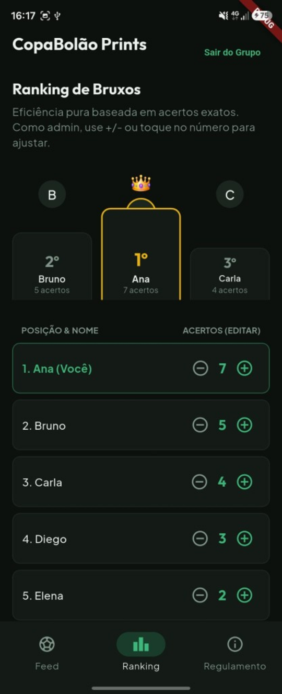
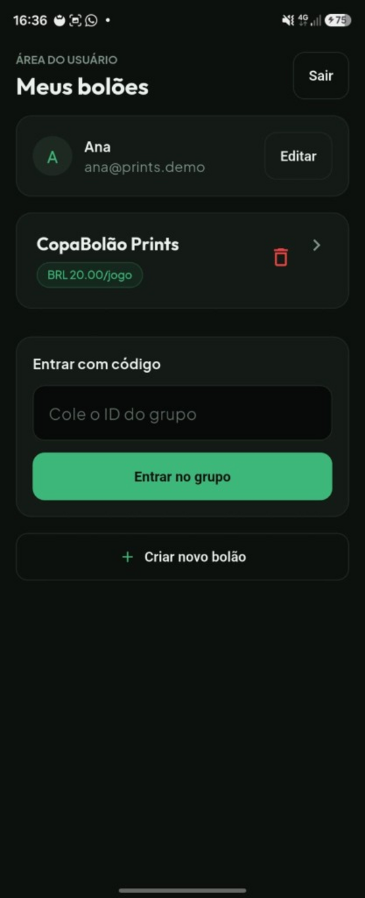
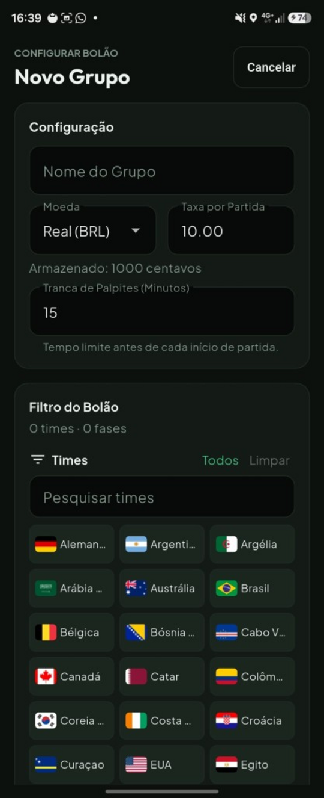
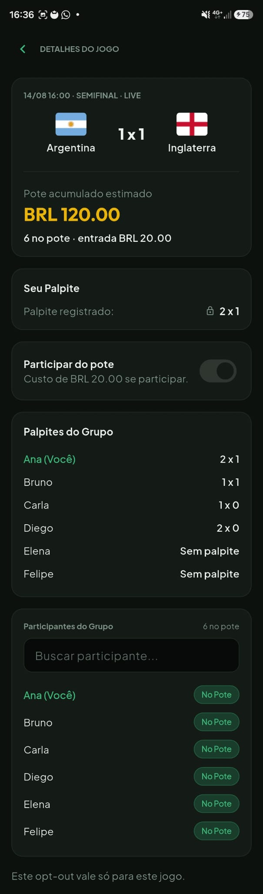
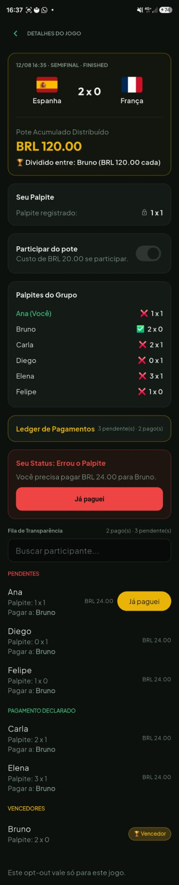

# Scorepool

<p align="center">
  
</p>

[](https://github.com/DaltonDjoesman/scorepool/actions/workflows/flutter-ci.yml)

> Exact-score pool for the 2026 FIFA World Cup. Friends call the score; only a perfect guess wins the pot.

Flutter client, Firestore, and TypeScript settlement logic. A group of friends used it during the tournament.

**Languages:** in-app UI copy is **Portuguese**; documentation in this repository is **English**.

---

## What it does

Friends join a group and bet on the **exact final score** of selected World Cup matches. Only a perfect guess wins the pot. If nobody guesses right, the pot rolls over to the next match (snowball effect). No money moves inside the app — winners are auto-calculated by the backend and losers self-declare payment on a public ledger that every group member can see in real time.

Key rules:
- **Exact score only** — guessing the correct winner is not enough.
- **Multiple winners** split the pot equally; each loser pays their individual share to each winner.
- **Zero winners** → full pot carries over to the next group match.
- **Participation is independent of prediction** — you can be in the pot without guessing a score (opt-out by the lock deadline to skip a round).
- **Prediction lock** — 15 minutes before kickoff; opt-out deadline is the same.
- **"I've paid" ledger** — public, live, grouped: pending first, declared-paid second.

---

## Scope

Computer Engineering project, used by a group of friends during the 2026 World Cup. The domain is the point: exact-score pots, carry-over, and a payment ledger the client cannot forge.

What the repository is set up to show:
- A layered Flutter app (screens, repositories, routing)
- A relational-ish domain (groups, rounds, debts, carry-over) on Firestore
- TypeScript business rules the client cannot bypass
- football-data.org consumed server-side, with results cached to stay inside the free tier
- Firestore Security Rules that enforce time windows and ownership

---

## Tech stack

| Layer | Technology | Role |
|---|---|---|
| Mobile app | Flutter / Dart | Android & iOS |
| Navigation | go_router | Declarative routing |
| Auth | Firebase Auth | Email/password |
| Database | Cloud Firestore | Real-time NoSQL; live payment ledger |
| Live ops (Spark) | GitHub Actions + Admin SDK scripts | Match catalog ingest, closeout / carry-over backfill |
| Backend code | TypeScript under `functions/` | Same domain logic; deployable as Cloud Functions on Blaze |
| Push | Firebase Cloud Messaging | Client stores FCM tokens; push *dispatch* needs deployed Functions |
| Match data | football-data.org API *(server-side only)* | Schedule, scores, team crests |
| Security | Firestore Security Rules | Server-enforced ownership and time-window rules |
| UI prototype | React (inline Babel) + CSS | Interactive HTML mockup used before Flutter |

---

## Architecture

```
┌──────────────────────────────────────────┐
│  Flutter app  (Android / iOS)            │
│  · firebase_auth · cloud_firestore       │
│  · firebase_messaging (token persist)    │
│  · go_router · repositories · screens    │
└───────────────────┬──────────────────────┘
                    │  real-time listeners + writes
┌───────────────────▼──────────────────────┐
│  Cloud Firestore                         │
│  · tournaments/{id}/matches (global)     │
│  · groups / members                      │
│  · groups/{id}/matches (group overlay)   │
│  · predictions / roundParticipants       │
│  · debts (payment ledger per match)      │
└───────────────────┬──────────────────────┘
                    │
        ┌───────────┴───────────┐
        ▼                       ▼
┌───────────────────┐   ┌───────────────────┐
│  GitHub Actions   │   │  functions/ (TS)  │
│  (live on Spark)  │   │  deployable path  │
│  · ingest catalog │   │  · same modules   │
│  · closeout       │   │  · optional CF    │
│    backfill       │   │    on Blaze       │
└─────────┬─────────┘   └─────────┬─────────┘
          └───────────┬───────────┘
                      ▼
┌──────────────────────────────────────────┐
│  football-data.org API                   │
│  (server-side only; results cached in    │
│   Firestore to stay within free tier)    │
└──────────────────────────────────────────┘
```

More detail: [`docs/architecture.md`](docs/architecture.md).

---

## Screenshots

Captured with `flutter run --dart-define=SCREENSHOT_DEMO=true` (see [`docs/screenshots/README.md`](docs/screenshots/README.md)). Gallery uses a **fixed width** so phone-framed shots stay aligned; taller scroll captures (match details / ledger) sit on their own rows.

<p align="center">
  
  
  
</p>
<p align="center"><em>Login · Feed (Próximos) · Ranking</em></p>

<p align="center">
  
  
</p>
<p align="center"><em>Group hub · Create group (48 WC2026 teams)</em></p>

<p align="center">
  
  
</p>
<p align="center"><em>Live match (locked predictions) · Finished match + payment ledger</em></p>

---

## Engineering highlights

**Pot math in integer cents** — all monetary amounts are stored and computed as integer cents (e.g. `200` for €2.00) to avoid floating-point drift. When the pot doesn't divide evenly across winners, the remainder is assigned deterministically to the first winner by stable sort so totals always balance exactly.

**Carry-over resilient to filter changes** — instead of chaining "nextMatchId" references (which break when a filter change removes a match), the group document holds a single `carryOverPot` field. It accumulates when a round ends with no winners and is applied to the next eligible group match when that match is activated. Filter changes can't corrupt the carry-over balance.

**Match filter as a set union** — a match enters a group if:
`homeTeamId ∈ selectedTeams OR awayTeamId ∈ selectedTeams OR stage ∈ selectedStages`
This lets groups follow specific national teams and also always include knockout rounds regardless of teams.

**Updating the filter without breaking history** — when an admin edits the filter, future unstarted matches can be added or soft-removed (`excludedByFilter: true`). Matches that are live, finished, or past prediction lock are never removed — their financial history is immutable.

**Server-enforced time windows** — prediction lock, opt-out deadline, and "paid" declaration deadline are enforced by Firestore Security Rules (and server scripts for settlement). The client never has authority over these timestamps.

---

## App screens

| Screen | Description |
|---|---|
| Login | Email/password sign-in and register |
| Groups | Create a group (currency, entry fee, match filter); join via code |
| Match feed | Tabs: Upcoming · Live · Finished; accumulated pot banner on rollover matches |
| Prediction input | Score input with live countdown to lock; opt-out toggle |
| Live match | Read-only view of all locked predictions ("secar palpites") |
| Match details | Final score, pot breakdown, winners |
| Payment ledger | Public debt list — pending first; "Já paguei" action per debt |
| Ranking | Perfect-score leaderboard; podium for top 3 |

> **Interactive prototype** — before building in Flutter, I designed all screens as a single-file React prototype. Open [`worldcup-bet-tracker.html`](worldcup-bet-tracker.html) in a browser to explore it.

---

## Architecture for readers

System layers, data model, and settlement path: [`docs/architecture.md`](docs/architecture.md).

---

## Running locally

### Prerequisites

- Flutter SDK `>=3.11`
- Node.js 20 (for ingest / Functions scripts)
- A Firebase project with Firestore and Auth enabled

See [`docs/firebase_setup.md`](docs/firebase_setup.md) for Firebase configuration. Client vs server secrets: [`docs/security.md`](docs/security.md).

### Flutter app

```bash
flutter pub get
flutter run --flavor prod                       # production Firebase
flutter run --flavor prod --dart-define=APP_ENV=dev  # same project today; reserved for a future dual-env setup
flutter run --flavor demo --dart-define=APP_ENV=demo # sandbox Firebase (see docs/demo_apk.md)
flutter run --dart-define=FIREBASE_ENABLED=false # widget tests, no Firebase
```

### Demo APK (sandbox Firebase)

Build locally with `--flavor demo` — it talks to `copabolaao-demo`, not production. A GitHub Release artefact is **not** attached yet; do not publish a production APK. Details: [`docs/demo_apk.md`](docs/demo_apk.md).

### Backend scripts (`functions/`)

```bash
cd functions
npm install
npm run build

# Ingest the WC 2026 match catalog into Firestore
npm run ingest:wc2026

# Run local scripts
npm run test:pot            # pot math unit tests
npm run test:reconciliation # group filter reconciliation tests
```

---

## Contributing

See [`CONTRIBUTING.md`](CONTRIBUTING.md) for setup, analyze/test, and PR expectations.

---

## Project status

Used by a group of friends during the 2026 World Cup. Not a commercial product. Settlement on the live Spark plan runs through GitHub Actions; the same TypeScript can be deployed as Cloud Functions on Blaze.

---

## Tooling

Built in [Cursor](https://cursor.com), with [Gemini](https://gemini.google.com) in the loop for generation, debugging, and docs. Product rules, security boundaries, and review are the author's.

## License

[MIT](LICENSE)
